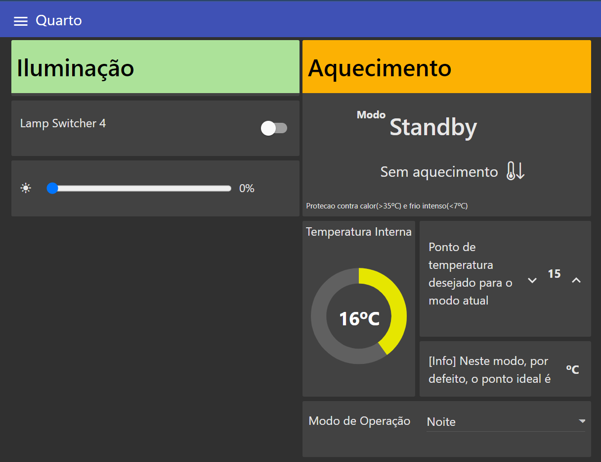

### Description
From a panel with devices that follow the KNX standard, programmable through ETS, the main objective is to build a dashboard using Node-Red within Home Assistant, simulating a residential environment
for controlling lighting, fans, heating (2 thermoelectric valves) and the electric movement of a curtain.

## Improvements

- Automation of processes with simulated variables, CO2 - interaction with the fan, lux - interaction with the curtain;
- Notification system in autonomous processes with status change to the smartphone;
- Weather information from HTTP requests to the IPMA and OpenWeather APIs;
- Voice and written control

## Technologies
KNX Protocol, Home Assistant, Node-Red, ETS (Engineering Software Tool), HTML, CSS, Javascript, AngularJS
